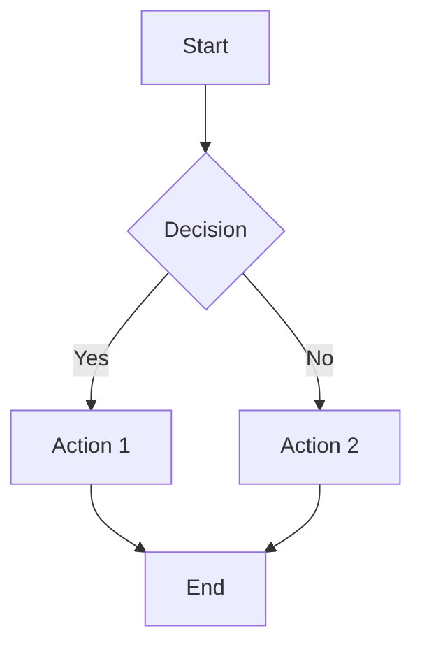
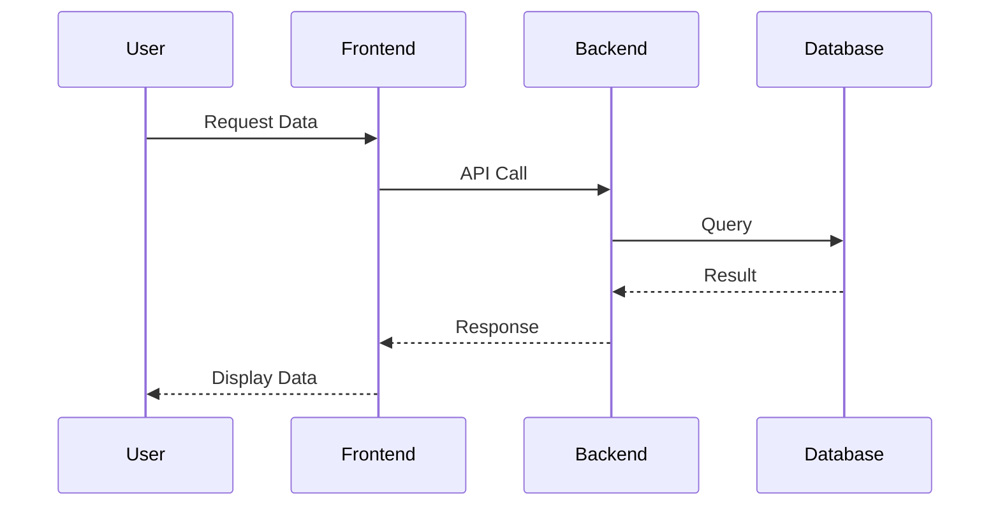
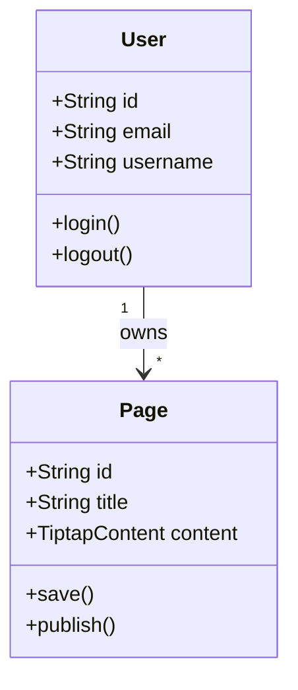
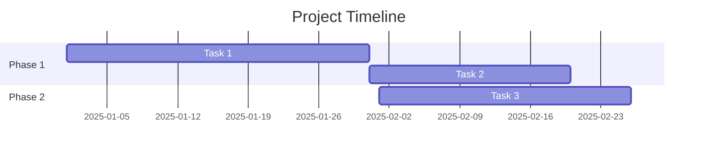
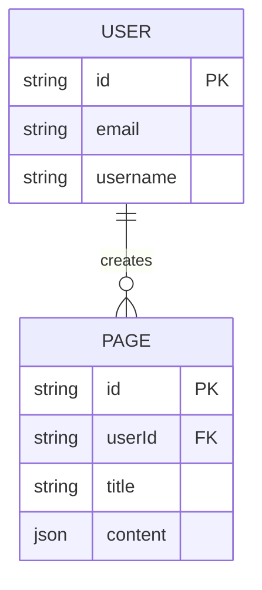

# 圖表整合指南

## Mermaid 圖表整合 ✅

### 概述
Mermaid 支援多種程式碼生成的圖表類型，適合用於技術文件和系統設計圖。

### 支援的圖表類型

1. **流程圖 (Flowchart)**


2. **序列圖 (Sequence Diagram)**


3. **類別圖 (Class Diagram)**


4. **甘特圖 (Gantt Chart)**


5. **ER 圖 (Entity Relationship)**


### 使用方式

#### 在 Angular 組件中使用

```typescript
import { MermaidDiagramComponent } from '@/shared/components/mermaid-diagram/mermaid-diagram.component';

@Component({
  imports: [MermaidDiagramComponent],
  template: `
    <app-mermaid-diagram
      [diagramCode]="flowchartCode"
      [theme]="'default'"
    />
  `
})
export class MyComponent {
  flowchartCode = `
    graph TD
      A[開始] --> B[處理]
      B --> C[結束]
  `;
}
```

#### 主題選項

- `default`: 預設主題
- `dark`: 深色主題
- `forest`: 森林主題
- `neutral`: 中性主題

### 功能特色

✅ 支援所有 Mermaid 圖表類型
✅ SSR 安全（僅在瀏覽器環境渲染）
✅ 深色模式支援
✅ 錯誤處理與顯示
✅ 響應式設計
✅ 可縮放的 SVG 輸出

---

## Excalidraw 整合 🚧 (計畫中)

### 概述
Excalidraw 提供手繪風格的圖表，非常適合 ByteByteGo 風格的技術圖解。

### 計畫功能

1. **手繪風格圖表**
   - 手繪線條與形狀
   - 箭頭與連接線
   - 文字標註

2. **編輯器功能**
   - 拖放介面
   - 多種形狀（矩形、圓形、箭頭等）
   - 顏色與樣式自訂
   - 匯出為 SVG/PNG

3. **整合方式**
   - Excalidraw 編輯器組件
   - 嵌入式圖表查看器
   - 圖表資料儲存在 Page.diagrams 欄位

### 實作計畫

**Phase 1: 基礎整合**
```bash
npm install @excalidraw/excalidraw
```

**Phase 2: 編輯器組件**
- 創建 ExcalidrawEditorComponent
- 提供繪圖工具列
- 支援匯入/匯出

**Phase 3: 查看器組件**
- ExcalidrawViewerComponent（唯讀模式）
- 在頁面中顯示已建立的圖表
- 點擊可進入編輯模式

**Phase 4: 整合到 Page Editor**
- 在 Tiptap 編輯器中插入 Excalidraw 圖表
- 管理多個圖表
- 圖表版本控制

### 資料結構

```typescript
interface ExcalidrawDiagram {
  id: string;
  type: 'excalidraw';
  content: {
    elements: any[];  // Excalidraw elements
    appState: any;    // Excalidraw app state
  };
  thumbnail?: string;  // Base64 PNG thumbnail
  createdAt: string;
  updatedAt: string;
}
```

### 使用範例 (未來)

```typescript
<app-excalidraw-editor
  [diagram]="currentDiagram"
  (diagramChange)="onDiagramChange($event)"
/>

<app-excalidraw-viewer
  [diagram]="savedDiagram"
  (editClick)="openEditor()"
/>
```

---

## 在 Tiptap 編輯器中使用圖表

### 未來擴展計畫

1. **Tiptap 自訂節點**
   - 創建 `MermaidNode` extension
   - 創建 `ExcalidrawNode` extension
   - 在編輯器中直接插入和編輯圖表

2. **圖表選擇器**
   - 工具列新增「插入圖表」按鈕
   - 彈出式選擇器（Mermaid vs Excalidraw）
   - 內聯編輯器

3. **圖表庫**
   - 儲存常用圖表模板
   - 快速插入預設圖表
   - 圖表分類與搜尋

### 範例：Tiptap Mermaid Extension (參考)

```typescript
import { Node } from '@tiptap/core';
import { MermaidDiagramComponent } from '@/shared/components/mermaid-diagram';

export const MermaidNode = Node.create({
  name: 'mermaid',

  group: 'block',

  content: 'text*',

  parseHTML() {
    return [{ tag: 'div[data-type="mermaid"]' }];
  },

  renderHTML({ node }) {
    return ['div', { 'data-type': 'mermaid' }, node.textContent];
  },

  addNodeView() {
    return ({ node }) => {
      // Render MermaidDiagramComponent here
      return {
        dom: div,
        contentDOM: pre
      };
    };
  },
});
```

---

## 最佳實踐

### Mermaid

1. **保持圖表簡潔**
   - 避免過多節點（建議 < 20 個）
   - 使用子圖 (subgraph) 組織複雜圖表

2. **命名規範**
   - 使用有意義的節點 ID
   - 避免特殊字元

3. **效能考量**
   - 複雜圖表可能影響渲染速度
   - 考慮使用靜態圖片替代超複雜圖表

### Excalidraw (未來)

1. **檔案大小**
   - 定期清理不需要的元素
   - 使用縮圖預覽

2. **協作**
   - 考慮版本控制
   - 匯出為 PNG 供分享

3. **無障礙**
   - 為圖表添加替代文字
   - 確保文字對比度

---

## 故障排除

### Mermaid 常見問題

**問題：圖表無法渲染**
- 檢查語法是否正確
- 確認瀏覽器環境（非 SSR）
- 查看控制台錯誤訊息

**問題：深色模式下顏色不對**
- 使用 `theme="dark"` 屬性
- 或在 Mermaid 程式碼中指定顏色

**問題：圖表太大**
- 使用 CSS 限制最大寬度
- 考慮分割成多個小圖表

### Excalidraw 常見問題 (未來)

**問題：載入緩慢**
- Excalidraw 套件較大（~2MB）
- 使用 lazy loading
- 考慮 CDN 或程式碼分割

**問題：圖表無法匯出**
- 檢查瀏覽器權限
- 確認匯出格式支援

---

## 技術規格

### Mermaid
- **套件**: mermaid (latest)
- **大小**: ~500KB (gzip)
- **瀏覽器支援**: 現代瀏覽器
- **授權**: MIT

### Excalidraw (計畫)
- **套件**: @excalidraw/excalidraw
- **大小**: ~2MB
- **瀏覽器支援**: 現代瀏覽器
- **授權**: MIT

---

## 進度追蹤

- [x] Mermaid 組件創建
- [x] 基礎渲染功能
- [x] 錯誤處理
- [x] 深色模式支援
- [ ] Tiptap Mermaid 節點
- [ ] Excalidraw 基礎整合
- [ ] Excalidraw 編輯器組件
- [ ] Excalidraw 查看器組件
- [ ] 圖表管理介面
- [ ] 圖表模板庫
